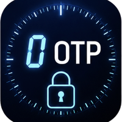

<div align="center">



# ZeroOTP

### Browser-native TOTP protection, with a session-bound Keycloak authentication profile

[](LICENSE)


*One repository, two related implementations: the standalone ZeroOTP browser application and the Keycloak session-bound authentication plugin.*

</div>

---

## Repository layout

```text
ZeroOTP/
├── README.md
├── COMPLIANCE.md
├── SECURITY-ARCHITECTURE.md
├── index.html
├── easy.html
├── full.html
├── biometry.html
├── compliance.html
├── css/
├── img/
├── js/
└── KeyCloakPlugin/
    ├── README.md
    ├── SECURITY-SESSION-BINDING.md
    ├── pom.xml
    ├── Dockerfile
    ├── docker-compose.yml
    └── src/
```

The root application and `KeyCloakPlugin/` are not separate products. The plugin is a derived server-side integration of the same ZeroOTP design: protect a TOTP secret with key material obtained through **WebAuthn PRF**, then use the recovered secret only after successful local user verification.

The Keycloak implementation extends that design with an additional property that is security-critical: **the TOTP is cryptographically bound to the current Keycloak authentication session**. A six-digit code alone is therefore not sufficient to authenticate through the plugin.

---

## 1. Standalone ZeroOTP

The standalone application runs entirely in the browser. All pages generate standards-compatible RFC 6238 TOTP values; the pages differ in user experience and in how the TOTP secret is stored or protected.

| Page | Purpose | Available protection/storage |
|---|---|---|
| `index.html` | Entry point and security/compliance overview | Links to the application variants |
| `easy.html` | Guided user experience | Password Manager, WebAuthn/PRF biometric vault |
| `full.html` | Complete interface | Password Manager, Cookie, LocalStorage, WebAuthn/PRF biometric vault |
| `biometry.html` | Dedicated PRF-protected vault | WebAuthn/PRF only; currently tested with Chrome |

### Protection methods

| Method | Description | Security consequence |
|---|---|---|
| Password Manager | TOTP material stored through the browser credential-management path | Storage protection depends on the browser/password-manager security boundary |
| Cookie | AES-encrypted with a user-supplied master password | TOTP remains a conventional transferable OTP after decryption |
| LocalStorage | AES-encrypted with a user-supplied master password | Same authenticator semantics as Cookie; only storage differs |
| WebAuthn PRF | A credential-scoped PRF output is transformed into an AES key used to decrypt the local TOTP secret | Strong local secret protection and verifier/origin binding for the **unlock operation**, but the standalone TOTP output remains transferable and is therefore not, by itself, phishing-resistant under NIST SP 800-63B-4 |

### Why PRF matters

The WebAuthn Level 3 `prf` extension exposes a credential-associated pseudo-random function through a WebAuthn ceremony. ZeroOTP uses its 32-byte output as input keying material, applies HKDF-SHA-256, and derives the AES-GCM key that protects the local TOTP secret.

The important security property is that the key is **not stored as a reusable application password**. To recover it, the browser must successfully invoke the appropriate WebAuthn credential and satisfy the authenticator's user-verification policy. The PRF is credential-scoped and the WebAuthn ceremony is RP/origin constrained.

PRF protection does **not**, by itself, transform a displayed or manually transferable TOTP into a phishing-resistant authenticator output. NIST explicitly excludes manually entered OTP outputs from phishing resistance because they are not bound to the session being authenticated. See [`COMPLIANCE.md`](COMPLIANCE.md) and [`SECURITY-ARCHITECTURE.md`](SECURITY-ARCHITECTURE.md).

---

## 2. ZeroOTP for Keycloak

`KeyCloakPlugin/` integrates the PRF-protected ZeroOTP model into a Keycloak Authentication SPI flow.

The plugin deliberately preserves RFC 6238 TOTP compatibility internally, but **TOTP is no longer the complete authentication protocol**. Version 1.1.0 adds a verifier-generated challenge and a cryptographic proof bound to the Keycloak `AuthenticationSession`.

### Authentication sequence

```text
Keycloak identifies the user
        |
        v
Keycloak creates a fresh 256-bit challenge
and stores it in AuthenticationSession
        |
        v
Browser performs WebAuthn get() + PRF
using the Keycloak challenge
        |
        v
Authenticator performs required user verification
(PIN / biometric / authenticator policy)
        |
        v
PRF output -> HKDF-SHA-256 -> AES-GCM key
        |
        v
Encrypted local TOTP secret is decrypted
        |
        +------------------------------+
        |                              |
        v                              v
RFC 6238 TOTP                  HMAC-SHA-256 session proof
                               over challenge + TOTP
        |                              |
        +---------------+--------------+
                        v
              TOTP + sessionProof
                        |
                        v
Keycloak verifies both values against the
same AuthenticationSession and consumes challenge
```

The session proof is conceptually:

```text
sessionProof = HMAC-SHA-256(
    TOTP-secret,
    "zerotp-session-v1\0" || serverChallenge || "\0" || totpCode
)
```

The protocol label provides domain separation. The 256-bit server challenge provides freshness and session uniqueness. The TOTP value is included in the MAC so the proof authenticates the exact OTP submitted in that transaction.

Consequences:

- an intercepted six-digit TOTP is insufficient to authenticate;
- a valid `TOTP + sessionProof` from authentication session A does not validate in session B;
- the challenge is single-use and is removed after the verification attempt;
- WebAuthn supplies verifier/RP binding to the PRF operation;
- the HMAC proof supplies explicit cryptographic binding to the verifier-created authentication session.

This is the architectural change that allows the plugin to be evaluated as a **cryptographic, phishing-resistant authentication protocol**, rather than merely as a conventional OTP flow. The detailed NIST analysis and the limits of that statement are in [`SECURITY-ARCHITECTURE.md`](SECURITY-ARCHITECTURE.md) and [`KeyCloakPlugin/SECURITY-SESSION-BINDING.md`](KeyCloakPlugin/SECURITY-SESSION-BINDING.md).

---

## 3. Run the standalone application

From the repository root:

```bash
python3 -m http.server 8080
```

Then open:

```text
http://localhost:8080/
http://localhost:8080/easy.html
http://localhost:8080/full.html
http://localhost:8080/biometry.html
```

WebAuthn and PRF require a secure context. `localhost` is treated specially by browsers for local development; non-local deployments require HTTPS.

---

## 4. Build and run the Keycloak plugin

From the repository root:

```bash
cd KeyCloakPlugin
mvn clean package
```

The current Maven project version is `1.1.0`, so the build produces:

```text
KeyCloakPlugin/target/zerotp-hardware-totp-1.1.0.jar
```

To build and start the included Keycloak/PostgreSQL development environment:

```bash
cd KeyCloakPlugin
docker compose up --build
```

The compose file currently publishes Keycloak on:

```text
http://localhost:8090
```

For detailed realm configuration, authentication-flow configuration, enrollment, provider IDs, and production considerations, see [`KeyCloakPlugin/README.md`](KeyCloakPlugin/README.md).

---

## 5. Security and compliance documentation

- [`COMPLIANCE.md`](COMPLIANCE.md) — concise NIST and Microsoft mapping.
- [`SECURITY-ARCHITECTURE.md`](SECURITY-ARCHITECTURE.md) — detailed technical architecture, threat model, cryptographic analysis, NIST terminology, and Microsoft comparison.
- [`KeyCloakPlugin/SECURITY-SESSION-BINDING.md`](KeyCloakPlugin/SECURITY-SESSION-BINDING.md) — implementation-level explanation of the Keycloak challenge and session proof.

The documents distinguish two different statements that must not be conflated:

1. **Security-property assessment:** whether a protocol has the technical properties NIST defines for phishing resistance.
2. **Product/policy recognition:** whether Microsoft Entra Conditional Access recognizes a method as one of its built-in `Phishing-resistant MFA strength` methods.

The Keycloak plugin can be assessed against the first question. It does **not** automatically become a Microsoft Entra built-in authentication method merely because its design has phishing-resistant properties.

---

## 6. Known limitations

The standalone demonstration retains intentionally simple storage options that are not production hardening recommendations. In particular, review `COMPLIANCE.md` before using Cookie or LocalStorage protection in a real deployment.

For the Keycloak plugin:

- Keycloak retains the verifier-side TOTP secret because RFC 6238 verification is symmetric.
- The browser endpoint remains within the trusted computing base during the transaction. Arbitrary code execution in the legitimate RP origin can defeat application-level confidentiality and integrity assumptions.
- Attestation metadata is recorded but the current plugin does not perform a complete trust-chain policy evaluation against FIDO Metadata Service metadata.
- AAL3 must not be claimed merely from this design. NIST AAL3 imposes additional requirements, including a non-exportable cryptographic key, public-key cryptography for the AAL3 cryptographic authenticator, phishing resistance, and applicable validation requirements.

---

## References

Primary specifications and guidance used by this repository are collected in [`SECURITY-ARCHITECTURE.md`](SECURITY-ARCHITECTURE.md). Core references include NIST SP 800-63B-4, W3C WebAuthn Level 3, FIDO CTAP 2.2, RFC 6238, RFC 5869, NIST HMAC guidance, NIST SP 800-38D, and Microsoft Entra authentication-strength documentation.

---

## License

MIT — see [`LICENSE`](LICENSE).
